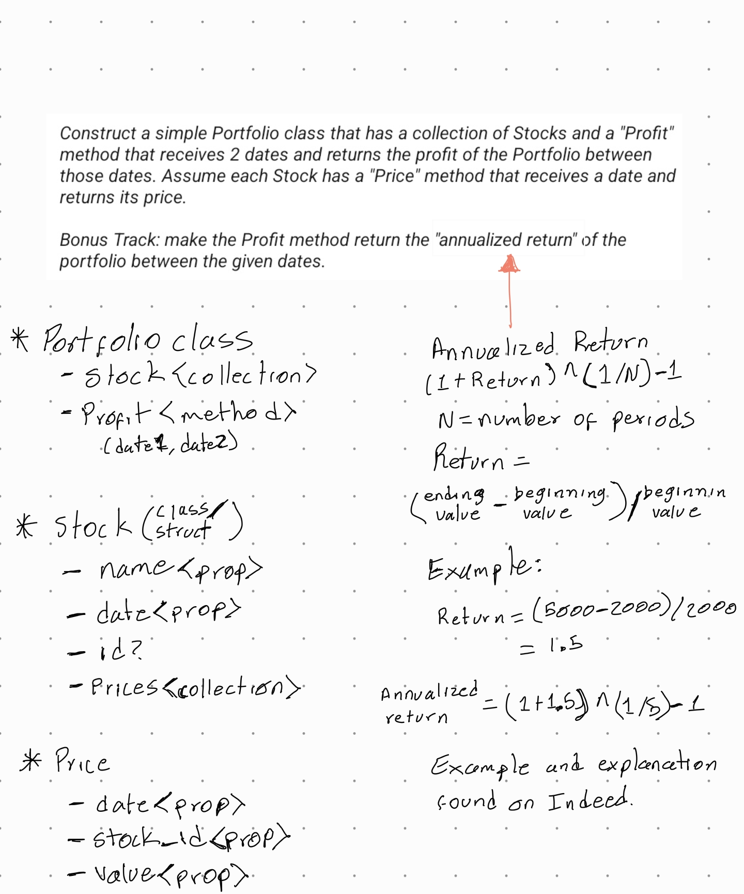

# Fintual stock exercise

### Initial draft



* According to the problem statement we can identify three entities.
  * Portfolio which will contain a collection of Stocks and a method to calculate the profit of the portfolio as a whole between two dates.
  * Stock that should handle individual stock elements and are related to a Portfolio. It also points to a method in which we can ask for the price of the stock in a given date.
    * Having the ability to ask for the price in a given date points out the existance of a price history for each Stock.

* Entities definition
  * Portfolio:
    * stocks (property): Collection of Stocks
    * profit (method): In charge to calculate the profits of the portfolio. Method I used to calculate the portfolio profits can be found [here](https://www.angelone.in/knowledge-center/share-market/how-to-calculate-portfolio-returns)
  * Stock:
    * id (property): The stock identifier
    * date (property): The date the stock was bought
    * prices: Collection of the stock prices across time
    * price (method): Return a price of the stock on the given date.
  * Prices:
    * stock_id (property): The related stock
    * value (property): The value of the stock at that time
    * date (property): The date on which the price was recorded
  * Probably missing things:
    * Multiple stock purchases between dates with different costs (either up or down)

#### Some seeding for testing
```ruby
stocks_list =[
  'AMD',
  'AMZN',
  'AAPL',
  'NVDA',
  'INTC'
]

prices = []
initial_date = DateTime.parse('2023-01-01')

for i in 1..180 do
  stocks_list.each do |stock|
    current_date = initial_date + i
    prices.push(Price.new(stock, rand(1..1000).to_f, current_date))
  end
end

stocks = []
stocks_list.each do |stock|
  results = prices.select {|price| price.stock_id == stock}
  stock_date = initial_date + (rand(1..180))
  stocks.push(Stock.new(stock, results, stock_date))
end

portfolio = Portfolio.new
portfolio.stocks = stocks
portfolio.profit
```
